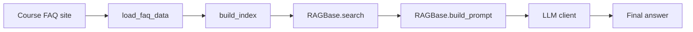

# llm-zoomcamp-2026-code

This repository contains a small retrieval-augmented generation (RAG) workflow for answering questions about the DataTalks.LLM Zoomcamp FAQ.

## Functional overview

The project has three main parts:

1. **Data ingestion** — fetches the FAQ content from the course website and normalizes it into documents.
2. **Indexing** — builds a search index so relevant FAQ entries can be retrieved quickly.
3. **Answer generation** — uses the retrieved context to produce grounded responses with an LLM.

## Architecture flow



## Repository layout

- [ingest.py](ingest.py) — downloads FAQ data and creates the search index.
- [rag_helper.py](rag_helper.py) — contains the RAG pipeline logic.
- [main.py](main.py) — command-line entry point for running the assistant.
- [notebook.ipynb](notebook.ipynb), [agentic-rag.ipynb](agentic-rag.ipynb), and [sqlite-ingest.ipynb](sqlite-ingest.ipynb) — exploratory notebooks that demonstrate different approaches.

## How to run

### 1. Install dependencies

```bash
uv sync
```

### 2. Run the assistant from the command line

```bash
python main.py "Can I still join the course after it started?"
```

### 3. Rebuild the index manually

```bash
python -c "from ingest import load_faq_data, build_index; docs = load_faq_data(); index = build_index(docs); print(type(index).__name__)"
```

## Notes

- The project is designed to use the FAQ data as the grounding source, so answers stay close to the course materials.
- The notebooks are useful for experimenting with different retrieval and prompting ideas, while the Python scripts provide the reusable implementation.

