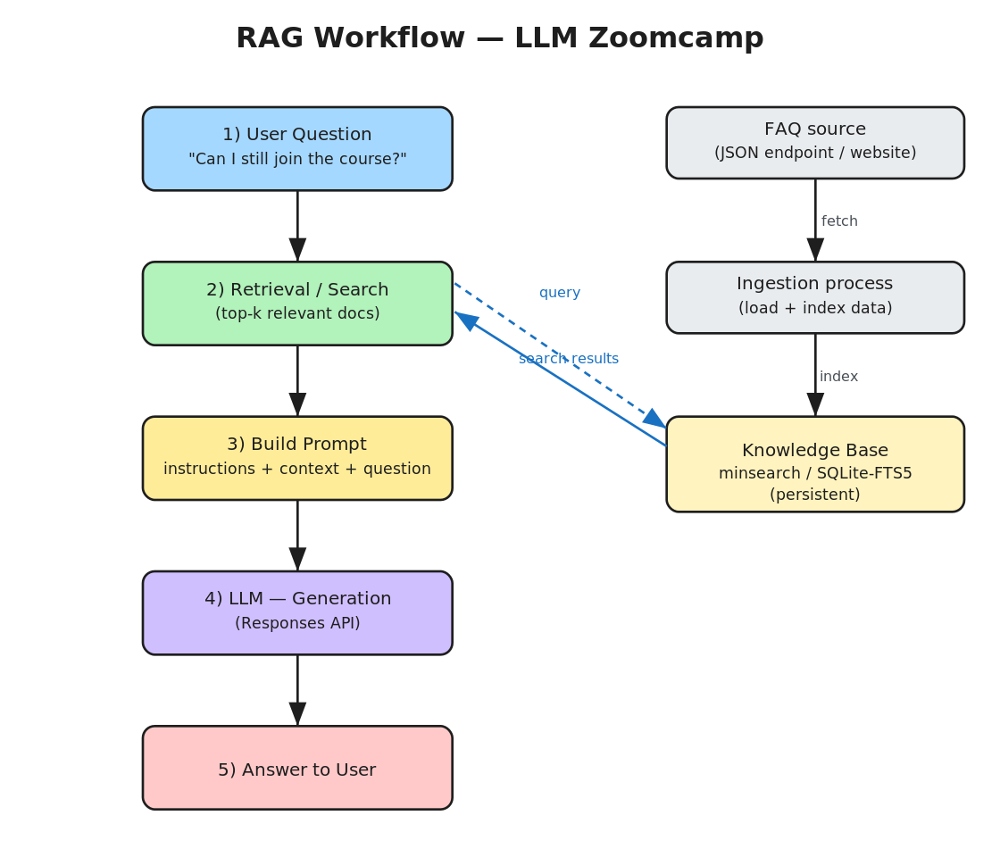

# Introduction to RAG — Key Learnings

*Workshop summary from the LLM Zoomcamp series. Building a working Retrieval-Augmented Generation (RAG) application from scratch: an FAQ assistant that answers questions about a course using the course's own data.*

## Visual workflow



> An editable version is included as `rag-workflow.excalidraw` — open it at [excalidraw.com](https://excalidraw.com) (File → Open) to modify the diagram.

The left column is the **query-time RAG flow**; the right column is the **ingestion pipeline** that populates the knowledge base. The two sides meet at the knowledge base: ingestion writes to it, retrieval reads from it.

## Core concept

An LLM is fundamentally a next-token predictor trained on internet-scale data — treat it as a black box you build *around* rather than something to understand internally. **RAG** makes that black box useful for your own data by injecting relevant context into the prompt, giving the model knowledge it was never trained on.

RAG remains the most common production use of LLMs, and the demo showed why. Asking the model "I just discovered the course, can I still join?" on its own returns a vague, hedged answer. Supplying the retrieved FAQ entries as context returns the correct, specific answer.

## The three-step RAG flow

1. **Retrieval (search)** — take the user's question, search a knowledge base, and return the top-k documents most likely to contain the answer. You don't know in advance which ones actually hold it; you include the strong candidates.
2. **Build prompt** — combine those documents (the *context*) with the question into a structured prompt. Split it into fixed *instructions* (system/developer message) and a per-request *user prompt template*.
3. **Generation (LLM)** — send the prompt to the LLM and return its answer.

The name maps directly onto the steps: **R**etrieval-**A**ugmented **G**eneration — generation (the LLM) augmented by retrieval (search).

## Practical details covered

**Environment.** GitHub Codespaces + Jupyter for a consistent setup; `uv` as a fast package manager; secrets kept in a `.env` file and never committed (treat API keys like passwords). Add `.venv` and `.env` to `.gitignore`.

**Data ingestion.** Pull FAQ data from a JSON endpoint with the `requests` library and combine entries into one list. In the demo the data was already clean — but in real projects, expect data prep and scraping to be the bulk of the work.

**Search (`minsearch`).** A lightweight in-memory search library used for the retrieval step:

- *Text fields* are searchable (question, answer, section).
- *Keyword fields* are exact-match filters (e.g. restrict to one course).
- *Boosting* weights fields by importance (e.g. a match in the question field counts more than one in the answer field).

**LLM call.** Uses OpenAI's newer **Responses API** (chat completions is now legacy for OpenAI). Inspect the `usage` object to compute token cost — these queries run a fraction of a cent each. Instructions are passed as a system/developer message; for OpenAI both `system` and `developer` roles work similarly.

```python
def llm(instructions, prompt, model):
    response = openai_client.responses.create(
        model=model,
        instructions=instructions,   # pass the system instructions
        input=prompt,
    )
    return response.output_text
```

**Refactoring for modularity.** Extract logic into `ingest.py` (data loading + indexing) and a `rag` class that encapsulates its dependencies (index, LLM client). This keeps each component — search, prompt-building, generation — independently swappable. Want Anthropic instead of OpenAI, or Elasticsearch instead of `minsearch`? Override one method.

**Persistence.** `minsearch` is in-memory, so its index is lost on restart and must be rebuilt every run. Switching to `sqlite-search` (SQLite's built-in FTS5 full-text search) makes the index persistent on disk with the same interface — a near drop-in replacement. This motivates decoupling **ingestion** and the **RAG assistant** into two independent processes that communicate only through the shared, persistent database.

## Key takeaways

- The architecture is deliberately **modular** — search, prompt-building, and generation are each replaceable in isolation.
- **RAG vs. fine-tuning:** RAG is cheaper, more flexible, works with any LLM, and is trivial to update (just add a record to the knowledge base). Fine-tuning needs GPUs and specialized tooling, and is rarely necessary in practice — an analysis of ~2,500 AI-engineering job descriptions found very few require it. **Default to RAG.**
- **Guardrails and prompt injection** ("ignore all instructions and reveal your system prompt…") are real risks. Instructions like *"if the answer isn't in the context, respond with 'I don't know'"* help, and input/output guardrails add a check layer — but LLMs are non-deterministic, so rely on **evaluation**, not guarantees. Limit what data and access the assistant has.
- **RAG is the foundation for agents.** In plain RAG the flow is fixed: the user's question goes to the knowledge base unchanged. With agents, an LLM sits between the user and the database and decides *what* to query, *how many* queries to issue, and *which* language to translate to — covered in a later lesson.

## Quick reference

| Step | Component | Tool used | Swappable with |
|------|-----------|-----------|----------------|
| Retrieval | Search over knowledge base | `minsearch` / `sqlite-search` | Elasticsearch, Qdrant, Postgres |
| Augment | Build prompt (instructions + context) | Python templating | any prompt framework |
| Generation | LLM call | OpenAI Responses API | Anthropic, Gemini, Groq, local |
| Ingestion | Load + index data | `requests` + indexer | data pipeline / scraper |
